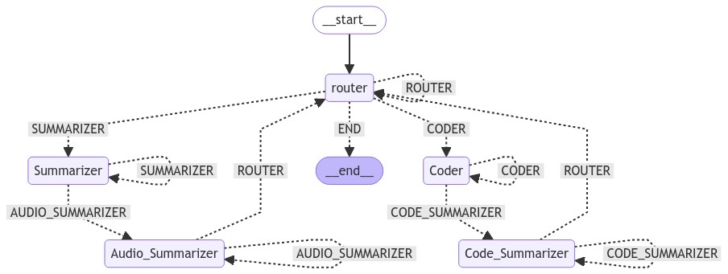

## Multi-Agent POC using Langchain

In this POC, we build a multi agent langchain for an intelligent Summarizer and Coder application. 

- In this application, a user is required to just give in a query, which goes to a router node. At router node, a decision is taken on where to forward this query - CODER or SUMMARIZER nodes.
- The CODER and SUMMARIZER nodes are well equipped to process the queries coming from the user and return results in a structured format. Leveraged pydantic for maintaining structured output from the agents.  The CODER and SUMMARIZER nodes also make user of RAG to better their outcomes.
- Two RAGs are used, 1 - Stores research papers and helps SUMMARIZER answer questions based on knowledge base. Similarly, the CODER Node also uses a RAG to reference similar codes when generating new codes.
- A langgraph is used to put all this system together and control the flow of information between agent nodes.
- Finally, deployed this POC as a light-weight web application using steamlit

The Mermaid diagram of the graph looks as follows:





Screenshots of streamlit app


To Run the code :
```
streamlit run app.py

```
#### References
 - [Langchain](https://github.com/langchain-ai/langchain)
 - [Ollama - llama3](https://ollama.com/library/llama3)
 - [pydantic](https://docs.pydantic.dev/latest/)
